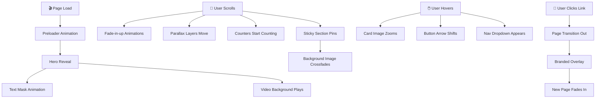

# CleanMax Website — Effects & Animation Analysis

> [!NOTE]
> This document breaks down every visual effect on [cleanmax.com](https://www.cleanmax.com/), names them with industry-standard terminology, and provides a comprehensive prompt you can use to build your own website with similar (but unique) effects.

## 📹 Website Recording

---

## 1. Glossary — What Are These Effects Called?

| Effect You See | Industry Term | Description |
|---|---|---|
| Page loads with a branded green screen first | **Preloader / Splash Screen** | A full-screen overlay that plays while assets load, then fades away |
| Background video playing in the hero | **Hero Video Background** | A muted, auto-playing cinematic video behind the main headline |
| Text slides up and fades in when the page loads | **Reveal Animation / Text Mask Reveal** | Text appears by sliding upward from behind an invisible clip mask |
| Elements appear as you scroll down | **Scroll-Triggered Animations (STA)** | Animations that fire when an element enters the viewport via `IntersectionObserver` |
| Elements fade in and move up on scroll | **Fade-In-Up** | The most common STA — opacity goes 0→1 while Y position shifts +20px→0 |
| Side images move slower than text | **Parallax Scrolling** | Background/side layers scroll at a different speed than the foreground, creating depth |
| Background stays fixed while text scrolls over it | **Sticky / Pinned Section (Scrollytelling)** | A section where the background image is `position: sticky` and content scrolls over it |
| Background image swaps as you scroll through topics | **Scroll-Driven Image Transition** | Combined with sticky positioning — images crossfade based on scroll progress |
| Numbers count up from 0 to a value | **Animated Counter / Count-Up** | Numbers rapidly increment from 0 to the target value when scrolled into view |
| Cards zoom their image on hover | **Image Scale-on-Hover** | `transform: scale(1.05)` on the image inside a card with `overflow: hidden` |
| Navbar stays at the top while scrolling | **Sticky / Fixed Navigation** | Nav bar uses `position: fixed` or `position: sticky` to remain visible |
| Active nav link has a green dot | **Active State Indicator** | A visual cue (dot, underline, highlight) showing the current page/section |
| Button arrow shifts right on hover | **Micro-interaction** | Small, subtle animations on interactive elements that provide feedback |
| Smooth transition between pages | **Page Transition Animation** | A branded animation (fade, slide, wipe) that plays between route changes |
| Footer has a video background | **Cinematic Footer** | Video background in the footer to bookend the experience |

---

## 2. Detailed Breakdown by Section

### 🎬 A. Preloader / Page Transition
- **What it does**: Full-screen branded overlay (green background + logo) appears on initial load and between page navigations
- **Tech term**: **Custom Preloader + Route Transition**
- **How it's built**: CSS animation + JS event listener on `window.onload` or router events
- **Libraries**: [Barba.js](https://barba.js.org/), [Swup](https://swup.js.org/), or custom with React/Next.js `useTransition`

### 🎥 B. Hero Section
- **Video Background**: Cinematic, muted, looping MP4/WebM video
- **Text Reveal**: Heading text uses a **clip-path mask animation** — text slides up from behind a rectangular mask
- **Subtitle Fade**: Subtext fades in with a slight delay (staggered animation)
- **CTA Button**: Appears with a fade-in after text animations complete

### 📜 C. Scroll-Triggered Animations (The Big One)
This is the **most impactful category** — it's what makes the site feel "alive."

| Element | Animation Type | Direction | Trigger |
|---|---|---|---|
| Section headings | Fade-in-up | Bottom → Up | Enters viewport |
| Body text paragraphs | Fade-in-up (delayed) | Bottom → Up | Enters viewport |
| Side images (wind turbines) | Slide-in + Parallax | Left/Right → Center | Enters viewport |
| Statistics cards | Fade-in + Counter starts | Bottom → Up | Enters viewport |
| Service cards | Staggered fade-in | Bottom → Up | Enters viewport (each card delayed by ~100ms) |

**Tech terms**: **Intersection Observer API**, **Scroll-Triggered Animation**, **Staggered Animation**
**Libraries**: [GSAP ScrollTrigger](https://gsap.com/docs/v3/Plugins/ScrollTrigger/), [AOS (Animate On Scroll)](https://michalsnik.github.io/aos/), [Framer Motion](https://www.framer.com/motion/)

### 🖼️ D. Sticky / Pinned Scrollytelling Section
- **What it does**: The "Asset Portfolio" section pins a large background image while descriptive text panels scroll over it. As you scroll past each text block, the background crossfades to a new image (Solar → Wind → Hybrid).
- **Tech term**: **ScrollTrigger Pin + Scrub Animation** or **Scrollytelling**
- **How it's built**: GSAP's `ScrollTrigger` with `pin: true` and `scrub: true`
- **This is the most advanced effect on the site**

### 🔢 E. Animated Counters
- **What it does**: Numbers like "570+", "4.3 GW", "85,000+" count up rapidly from 0
- **Tech term**: **Count-Up Animation**
- **Libraries**: [CountUp.js](https://inorganik.github.io/countUp.js/), or custom with `requestAnimationFrame`

### 🃏 F. Card & Image Hover Effects
- **Image zoom**: `transform: scale(1.08)` with `transition: 0.4s ease` on `.card:hover img`
- **Overlay darken**: Slight dark overlay appears on hover
- **Text shift**: Card text may shift slightly upward on hover
- **Tech term**: **Hover Micro-interactions**

### 🧭 G. Navigation
- **Fixed/sticky** at the top of the page
- **Dropdown menus** with smooth fade-in on hover
- **Active page indicator**: Small green dot under the active link
- **Hamburger menu** on mobile with slide-in panel

### 🎯 H. Button Micro-interactions
- Arrow icon shifts right by ~4px on hover
- Background color transitions smoothly
- Subtle box-shadow appears on hover
- **Tech term**: **Micro-interactions / Micro-animations**

---

## 3. The Umbrella Terms

When talking about ALL of these effects together, you can use these terms:

| Term | Meaning |
|---|---|
| **Motion Design** | The overall discipline of adding animation to web interfaces |
| **Scroll-Based Storytelling** | Using scroll position to drive narrative and visual transitions |
| **Micro-interactions** | Small, targeted animations that respond to user actions |
| **Cinematic Web Design** | A design approach using video, parallax, and reveal animations for a movie-like feel |
| **Immersive Web Experience** | A website that uses animation, video, and interactivity to deeply engage users |

---

## 4. Recommended Tech Stack for These Effects

| Effect Category | Best Library | Alternative |
|---|---|---|
| Scroll animations (fade-in, slide-in) | **AOS.js** (simplest) | GSAP ScrollTrigger (most powerful) |
| Parallax scrolling | **GSAP ScrollTrigger** | Rellax.js, Locomotive Scroll |
| Sticky/pinned sections | **GSAP ScrollTrigger** | Locomotive Scroll |
| Page transitions | **Barba.js** | Swup, Next.js App Router transitions |
| Counter animations | **CountUp.js** | Custom JS |
| Smooth scrolling | **Lenis** | Locomotive Scroll |
| General animations | **GSAP** | Framer Motion (React), Anime.js |

---

## 5. 🚀 Ready-to-Use Prompt

> [!IMPORTANT]
> Use this prompt with a developer, AI coding assistant, or design tool. It captures the *essence* of CleanMax's effects without copying their design.

---

### The Prompt

> **Build a modern, premium, single-page (or multi-page) website with a cinematic, immersive feel. The website should incorporate the following motion design and interactive effects:**
>
> **1. Preloader & Page Transitions**
> - A full-screen branded preloader animation on initial page load (logo fade-in + progress bar or spinning animation, then a smooth wipe/fade reveal of the page content)
> - Smooth animated transitions between pages (fade-out → branded overlay → fade-in)
>
> **2. Hero Section**
> - Full-viewport hero with either a **muted looping background video** or a **high-res image with a Ken Burns (slow zoom/pan) effect**
> - Headline text that uses a **split-text reveal animation** — each word or line slides up and fades in with a slight stagger (0.1s delay between each)
> - Subtitle and CTA button fade in after the headline animation completes
> - A subtle **scroll indicator** (animated bouncing arrow or mouse icon) at the bottom
>
> **3. Sticky Navigation**
> - Fixed navbar that **changes background from transparent → solid (with blur/glassmorphism)** after scrolling past the hero
> - Smooth dropdown menus on hover with fade-in animation
> - Active section indicator (animated underline or dot) that updates based on scroll position
>
> **4. Scroll-Triggered Animations (Throughout the Page)**
> - **Fade-in-up** for all text blocks and headings as they enter the viewport
> - **Slide-in-from-left/right** for images and decorative elements
> - **Staggered animations** for card grids (each card animates in with a 100ms delay after the previous)
> - **Parallax scrolling** on background images and decorative elements (move at 0.3x–0.7x scroll speed)
> - All animations should trigger once when the element is ~20% visible and should use easing (ease-out or cubic-bezier)
>
> **5. Scrollytelling / Pinned Section**
> - At least one section where a large background image or visual **stays pinned/sticky** while text content scrolls over it
> - As the user scrolls through different text blocks, the pinned background **crossfades to a new image** matching the current topic
> - This creates a "story-driven" scroll experience
>
> **6. Animated Statistics/Counters**
> - A stats section where numbers **count up from 0 to their target value** when scrolled into view
> - Use easing on the count-up (fast start, slow finish) for a polished feel
> - Include a "+" or unit suffix that appears after the count completes
>
> **7. Interactive Cards**
> - Service/product cards with **image zoom on hover** (scale 1.05–1.1x, overflow hidden)
> - Subtle **overlay darkening** or **gradient overlay** on hover
> - Card content (title/description) shifts up slightly on hover
> - Optional: **3D tilt effect** on hover using CSS perspective transforms
>
> **8. Smooth Scrolling**
> - Implement **smooth/momentum scrolling** using Lenis or Locomotive Scroll for a buttery, premium scroll feel
> - All anchor links should scroll smoothly to their target
>
> **9. Button & CTA Micro-interactions**
> - Buttons should have: background color transition, subtle scale-up (1.02x), and icon movement (arrow shifts right) on hover
> - Optional: magnetic button effect (button slightly follows the cursor when nearby)
>
> **10. Footer**
> - A cinematic footer with a **background video or parallax image**
> - Contact info and links fade in with scroll-triggered animations
> - Social media icons with hover scale + color change effects
>
> **Technical Requirements:**
> - Use **GSAP + ScrollTrigger** for scroll animations and pinned sections
> - Use **Lenis** for smooth scrolling
> - Use **CountUp.js** or custom implementation for number animations
> - Ensure all animations are **performant** (use `transform` and `opacity` only, avoid layout-triggering properties)
> - All animations should **respect `prefers-reduced-motion`** media query
> - Mobile responsive — simplify/disable heavy animations on mobile for performance
> - Target **60fps** throughout

---

## 6. Quick Visual Summary

---

> [!TIP]
> **Start simple**: Implement scroll-triggered fade-in-up animations first (using AOS.js — just 2 lines of setup). Then layer on parallax, sticky sections, and page transitions. Don't try to build everything at once!
